# 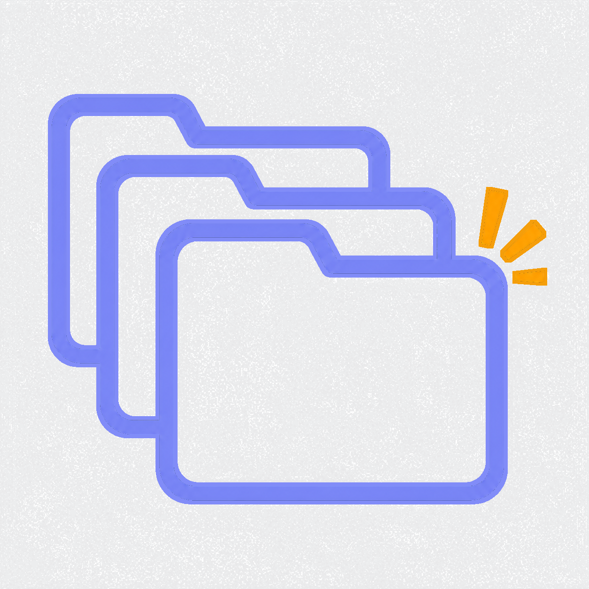 KaTab

**Your browser's new tab, reimagined.** KaTab replaces Chrome's new tab page with a kanban-style workspace — group sites into Collections, capture ideas with Notes, and drag open tabs straight into your boards.

[简体中文](./README.zh-CN.md)

---

## Overview

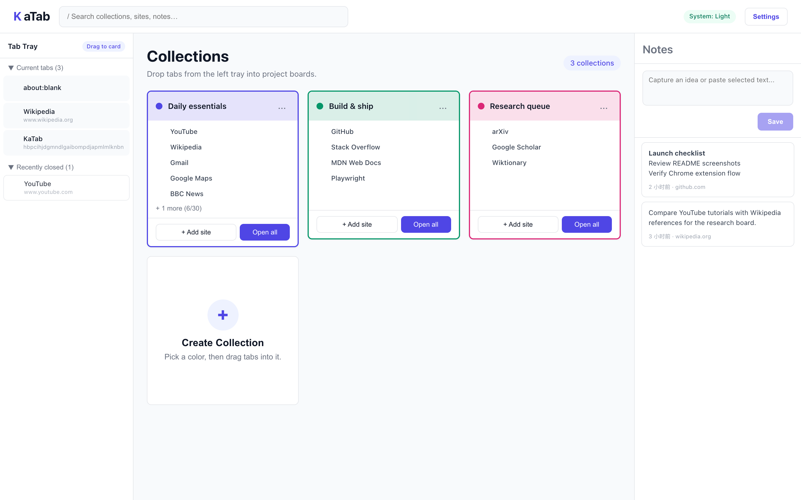

---

## Features

### 📋 Boards — Two-level organization

Organize your workspace with **Boards** (top level) and **Collections** (second level). Switch between boards from the top bar to focus on different areas of your life — Work, Personal, Research, and more.

- **Board switcher** — pill-style tabs in the top bar; click to switch the active board
- **Board CRUD** — create, rename, and delete boards; move or delete collections when removing a board
- **Scoped collections** — each board shows only its own Collection cards
- **Global search** — search across all boards; clicking a site result switches to the correct board and opens the URL in a new tab
- **Auto-migration** — existing Collections are moved into a default board on first load after upgrading

---

### 📁 Collections — Organize sites into project boards

Group related websites into named, color-coded boards called Collections.

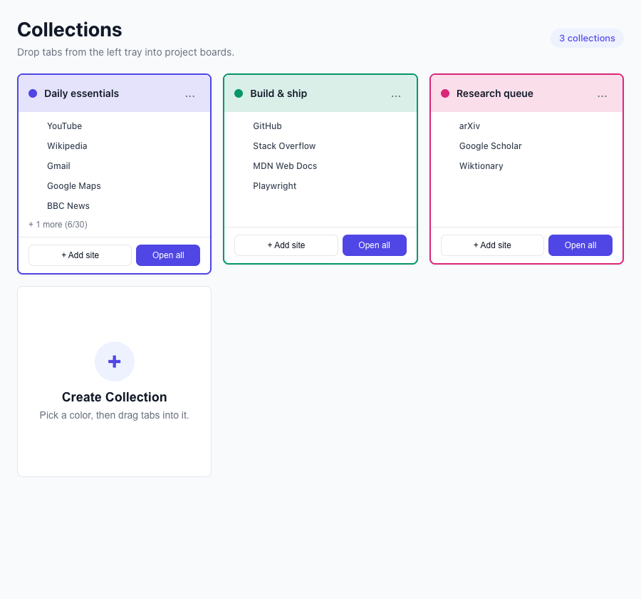

- **One-click open** — launch every site in a Collection as a Chrome Tab Group, colors included
- **Color-coded Tab Groups** — Collection color maps automatically to the nearest Chrome Tab Group color
- **Drag to reorder** — rearrange cards on the board with snap-to-grid
- **Site management** — add, delete, and reorder sites within a card; search inside the full-view modal

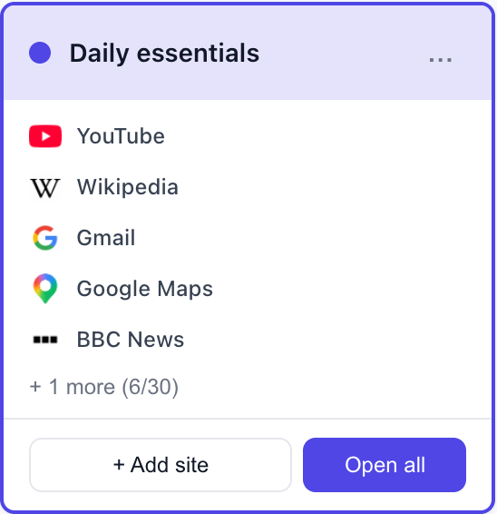

> Click **Open all** on any card to open all its sites at once — choose between the current window (Tab Group) or a new window.

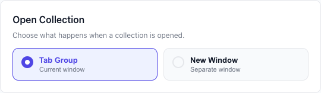

---

### 📝 Notes — Capture ideas without leaving the page

**From any webpage:** select text, click the floating **KA** button, edit if needed, and save — the note lands in your Notes panel with the source URL attached.

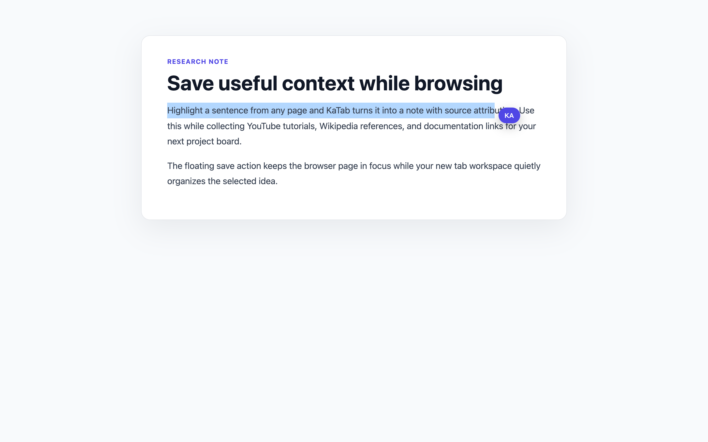

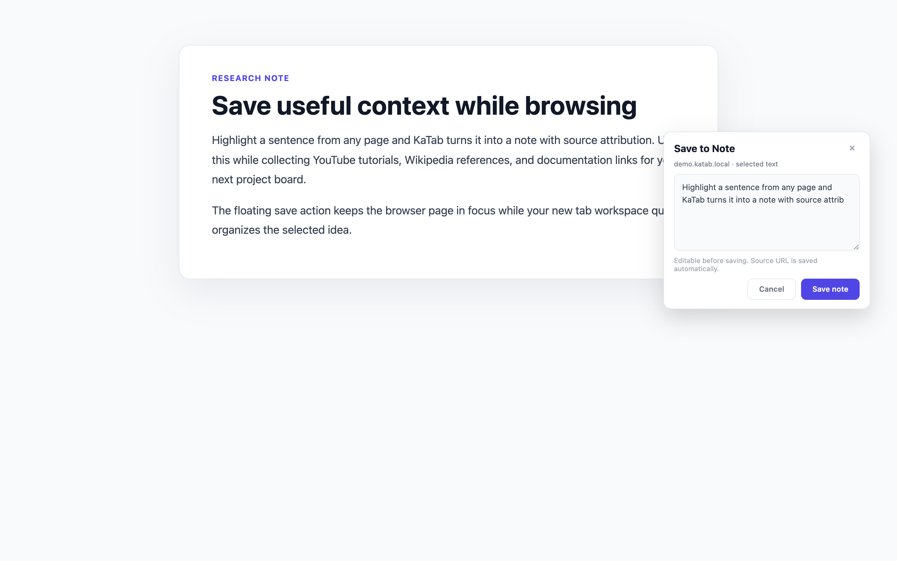

**From the new tab:** type directly into the Notes sidebar, supports Markdown basics.

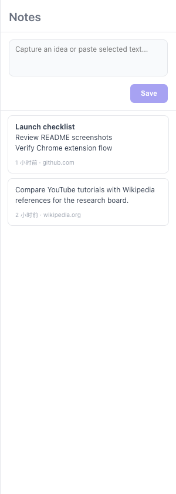

---

### 🗂️ Tab Tray — Your open tabs, right there

The left sidebar shows every tab you have open right now, plus recently closed ones. Drag any item straight onto a Collection card to save it.

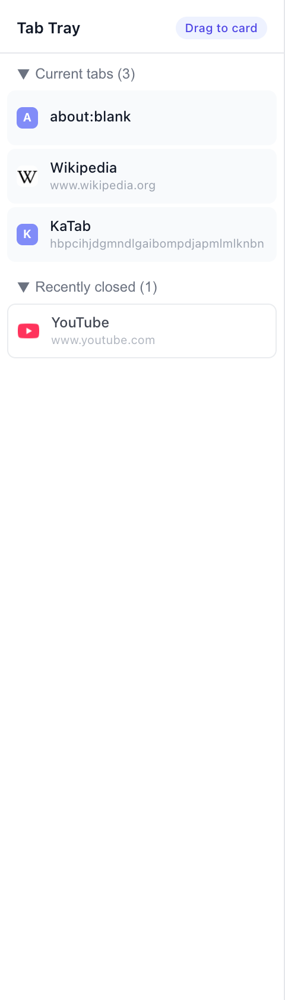

- **Current tabs** — live list of all open tabs in the current window
- **Recently closed** — last 25 closed tabs, drag-to-save just like open ones
- Click any item to jump to (or restore) the tab

---

### 🔍 Search

Search across all Boards, Collections, sites, and Notes from the top bar. Clicking a site result switches to its board and opens the page in a new tab.

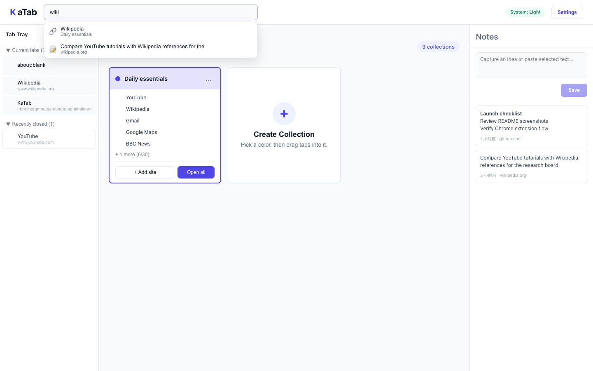

---

### ⚙️ Settings

Configure color palettes for Collections, theme (light/dark), and data backup.

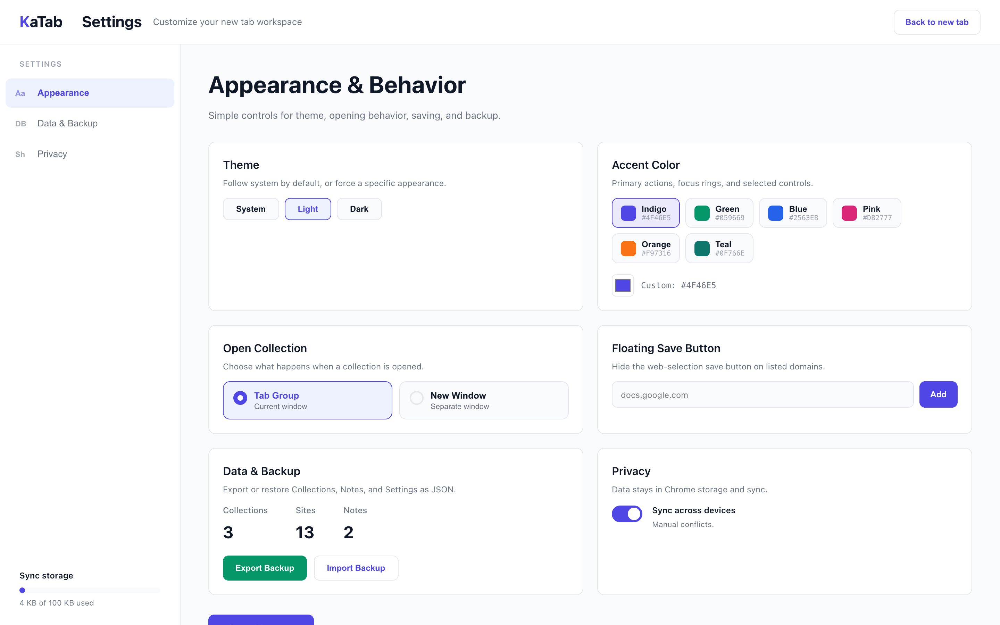

---

### ☁️ Sync (local file & WebDAV)

All Boards, Collections, Notes, and Settings are stored locally in `chrome.storage.local`. Under Options → **Sync** you can:

- **Export / import** a JSON snapshot file locally (same format as WebDAV)
- Configure your own WebDAV server (Nextcloud, Jianguoyun, Synology, etc.) to sync `katab-sync.json` across devices. Credentials stay on this device only.

- Auto-sync every ~5 minutes after local changes (when WebDAV is enabled)
- Pull from remote on extension startup
- Manual **Sync now / Upload / Download** buttons
- Conflict resolution banner on the new tab when two devices edit the same item

---

## Development

### Prerequisites

- **Node.js** ≥ 18
- **pnpm** ≥ 9

### Setup

```bash
git clone https://github.com/your-username/ka-tab.git
cd ka-tab
pnpm install
```

### Dev server (hot-reload)

```bash
pnpm dev
```

Then open `chrome://extensions`, enable **Developer mode**, click **Load unpacked**, and select `.output/chrome-mv3-dev/`.

### Production build

```bash
pnpm build
# output → .output/chrome-mv3/
```

### Useful scripts

| Command | Description |
|---------|-------------|
| `pnpm dev` | Dev server with hot-reload |
| `pnpm build` | Production build |
| `pnpm zip` | Build + zip for Chrome Web Store |
| `pnpm lint` | Lint with Biome |
| `pnpm check` | Lint + format (auto-fix) |
| `pnpm typecheck` | TypeScript type-check |
| `pnpm test:unit` | Unit tests (Vitest) |
| `pnpm test:integration` | Integration tests (Playwright) |
| `pnpm test:all` | All tests |

### Project structure

```
src/
├── entrypoints/
│   ├── newtab/          # New tab page — main UI
│   ├── content/         # Content script — floating KA button & note panel
│   ├── background/      # Service worker — message handlers
│   └── options/         # Settings page
├── features/
│   ├── boards/          # Board logic, switcher, migration
│   ├── collections/     # Collection logic, cards, drag-drop
│   ├── notes/           # Note panel and storage
│   └── tab-tray/        # Current tabs & recently closed
└── shared/
    ├── messaging/        # Chrome runtime message types & client
    ├── storage/          # Storage keys & helpers
    └── settings/         # User preferences
```

### Tech stack

| | |
|---|---|
| UI | [SolidJS](https://solidjs.com) |
| Extension tooling | [WXT](https://wxt.dev) (Chrome MV3) |
| Styling | [UnoCSS](https://unocss.dev) |
| Drag & drop | [@thisbeyond/solid-dnd](https://github.com/thisbeyond/solid-dnd) |
| Linting | [Biome](https://biomejs.dev) |
| Testing | [Vitest](https://vitest.dev) + [Playwright](https://playwright.dev) |

---

## License

MIT

